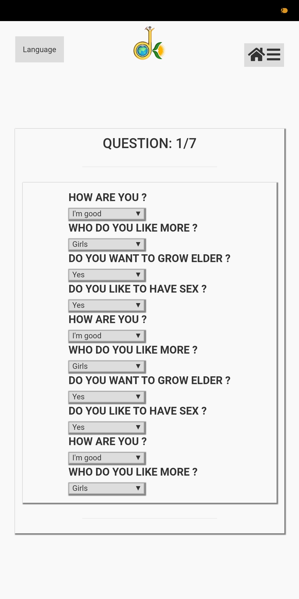

# DishaKiran-Docs

## Current Screens

### Splash

### Home

### Login

	

### Profile

	

### Payment

	

### Test

	

### Result

	

### Feedback

	

### Chat

	

### Exit

	

## Steps and Work Flow
*(Provided in mail containing the flow diagram)*
*(Checked fields have been completed)*

### User downloads and install App

- [ ] Android App
- [ ] iOS App
- [ ] Windows App

- [ ] Google PlayStore
- [ ] Apple Playstore
- [ ] Windows Store

### Spalsh-DS symbol

- [x] index.html

### Home screen appears

- [x] home.html

- [x] chatbot
- [ ] search button

### Login

- [x] login.html

- [x] Phone
- [x] Email
- [x] Facebook
- [ ] Google
- [ ] Instagram
- [ ] Twitter
- [x] LinkedIn

### "A" option screen (chat)

- [x] test_instructions.html

### Without Logging in

- [ ] ...

### Test

- [x] test.html

- [ ] disclaimer
- [ ] clock
- [x] pagination (10 que per page)
- [ ] pause and resume
- [x] submit

### Result

- [x] test_result.html

- [x] basic result
- [x] payment option
- [ ] promocode
- [x] no download or screendsot to free user

### Payment

- [x] payment.html

- [x] razorpay
- [x] no option to go back
- [x] chatbot, search and home disappear

### After Payment (Feel Good)

- [ ] post_payment.html

- [x] unique user id
- [x] downloadable content
- [x] chatbot, search and home reappear
- [ ] promocode
- [ ] refferals

### Feedback

- [x] feedback.html

- [x] start rating, mcq, text
- [ ] exciting offers
- [x] Exit or Homepage

### Exit

- [x] exit.html

### Post Exit

- [ ] Email result
- [ ] Push Notifications

## Requirements

* Changes in UI/UX of above screens ? *(I have layout got of home screen)*
    * What all are missing or extra components ?
    * Are there any speific images/ colors to be used ? *(Have got some in yesterday's mail)*
    * Changes in grid layout of above screen ?
    * Any new screens or missing screens ?
* Questions and Evaluation Strategy ?
* Will the user be paying for every test or we make them premium customers for some time period (like 1 year or so) ?
* FAQs and flow of questions ? *(What should be the next qusetion/response depending on previous answer)*
* Why we need search ?
* What will be the process when a person proceeds without logging in ?
* Disclaimer and test instructions ?
* What kinds of promocodes and offers will be applicable ? *(Can be done even later)*
